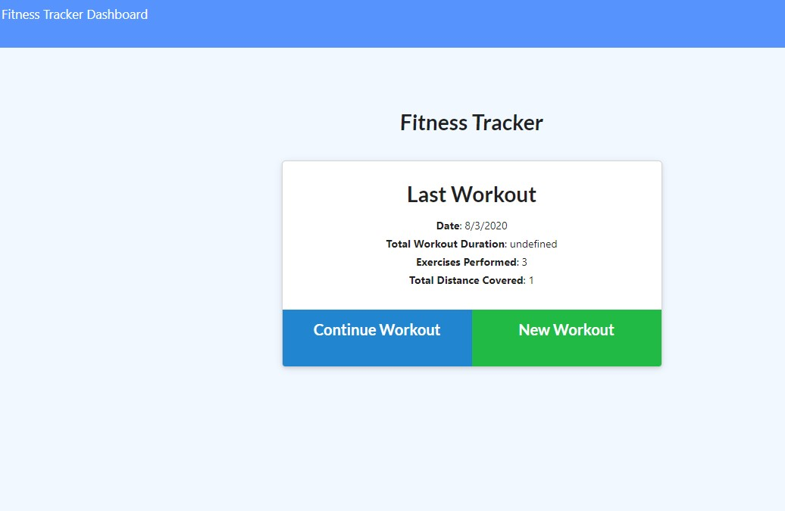
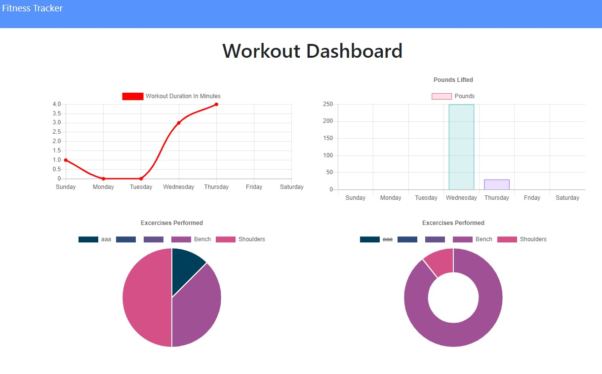

  # Workout-Tracker

  

  # Description
  Application to log workouts daily and to update stats

  #Table of Contents
  * [Installation](#installation)
  * [TableOfContents](#tableOfContents)
  * [Installation](#installation)
  * [Usage](#usage)
  * [Image](#image)
  * [Video](#video)
  * [License](#license)
  * [Tests](#tests)
  * [Questions](#questions)
  
  # Installation

  NPM i, express, morgan, mongoose

  
  # Usage

  Using mongoDB, the user enters their workout data via a front end html page

  
  # Images

  
  

  # License

  Shareware

  # Tests

  

  
  # Questions

  

  [Link to my GitHub](https://github.com/whiterice2020)

  If you have any quesitons, you can email me at github@delpadre.xyz

